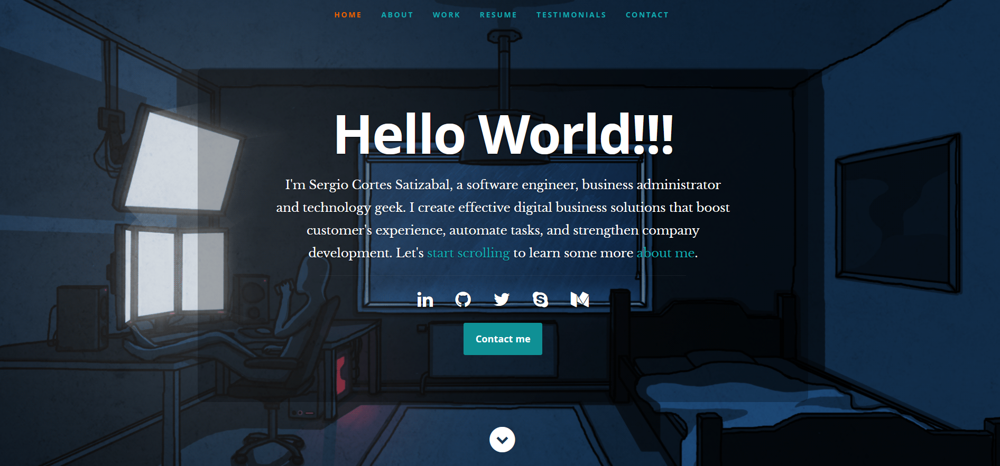

# Sergio Cortes Satizabal Portfolio

## Table of Contents
   

* [About the Project](#about-the-project)
* [Built With](#built-with)
* [Contact](#authors)
* [Acknowledgements](#acknowledgements) 

#
 

  
  
  

 

-[Live page](https://sergiocortes.me)

<!-- ABOUT THE PROJECT   -->
## About The Project

Hello. Here you will find my personal portfolio. Please feel free to drop any comment or suggestion you might have. 

## Screenshot Test
#

  

## Authors

👤 Sergio Cortes Satizabal

- Github: [@sergiocortessat](https://github.com/sergiocortessat)
- Twitter: [@sergiocortessat](https://twitter.com/sergiocortessat)
- LinkedIn: [@sergiocortessat](www.linkedin.com/in/sergio-cortes-satizabal-3b452194)

Project Link: [SCS Portoflio Issues](https://github.com/sergiocortessat/SCS_Portfolio/issues/1)

### Built With

* [HTML]
* [CSS]
* [Bootstrap]
* [Jquery]

<!-- ACKNOWLEDGEMENTS -->
## Acknowledgements

* [Microverse](https://www.microverse.org/)

## 📝 License

This project is [MIT](https://github.com/sergiocortessat/sergiocortessat/blob/main/LICENSE) licensed.

